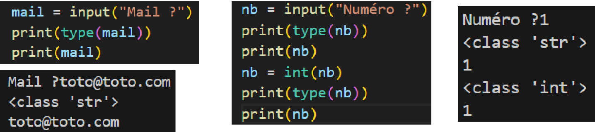
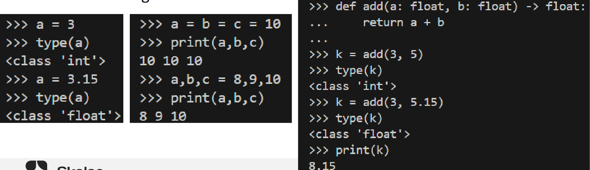

# Les bases de Python

Les commentaires
Quel que soit le langage que vous allez utiliser, les commentaires sont
importants et nécessaires. Que vous soyez en équipe ou en solo.

En python, il existe deux types de commentaires:

• Le `#`, permet de commenter une ligne uniquement

• Les triples quotes 
```
”””Ceci est un commentaire””” 
```
permettent de commenter plusieurs lignes.

Pour rappel, sur la première ligne du fichier, il est habituel de mettre un
shebang (#!)
• Indique au système d’exploitation que le fichier est un script
• Sur la même ligne, on précise l’interpréteur utiliser (python/python3/bash/etc)

• Exemple: 
```
#!/usr/bin/python
```
## Normes de codage

Lorsque plusieurs personnes travaillent sur un projet, il est commun de
définir des normes de codage, afin que tout le monde code de la même
façon:
• Le style d’indentation (tab/espaces, 2 ou 4 – PEP8 indique 4 espaces)
• Les commentaires (Anglais, clair et concis)
• Le nom et l’organisation des fichiers
• camel case ou snake case
• En général, l’un est choisi pour les fonctions et l’autre pour les variables

```py
def xml_to_pdf(optionsInfos, optionsObjects, xmlReport):
def xmlToPdf(options_infos, options_objects, xml_report):
```
Les variables
Comme tous les langages, python dispose de plusieurs types de variables.
Les plus courants sont:
• Int (integer, nombres entiers)
• Float (nombre décimal,)
• Str (string, chaîne de caractères, toujours entre “” ou ‘’)
• Bool (booléen, True ou False, 0 ou 1)
• Hex (hexadecimal)
• Bin (binaire)
• Etc
La commande type(varName) permet de connaître le type d’une variable.

Python attribut automatiquement le bon type de variable
Une variable change de type automatiquement si le type de son
contenu change.
<div align="center">
    
  </div>


Interaction utilisateur
Avoir une interaction avec l’utilisateur peut être utile:
• Nous allons donc utiliser le mot-clé: input
• Tous les inputs sont des string, si vous souhaitez avoir un integer ou autre, il
faudra faire la conversion
<div align="center">
    
</div>

## Les structures de données

Il existe plusieurs structures de données au sein de Python:
- Les listes, associées aux crochets []
- Les dictionnaires, associés aux accolades {}
- Les tuples, 2 éléments ou plus, immuables, entre parenthèses ()

Ces structures de données sont des types de variables à part entière
